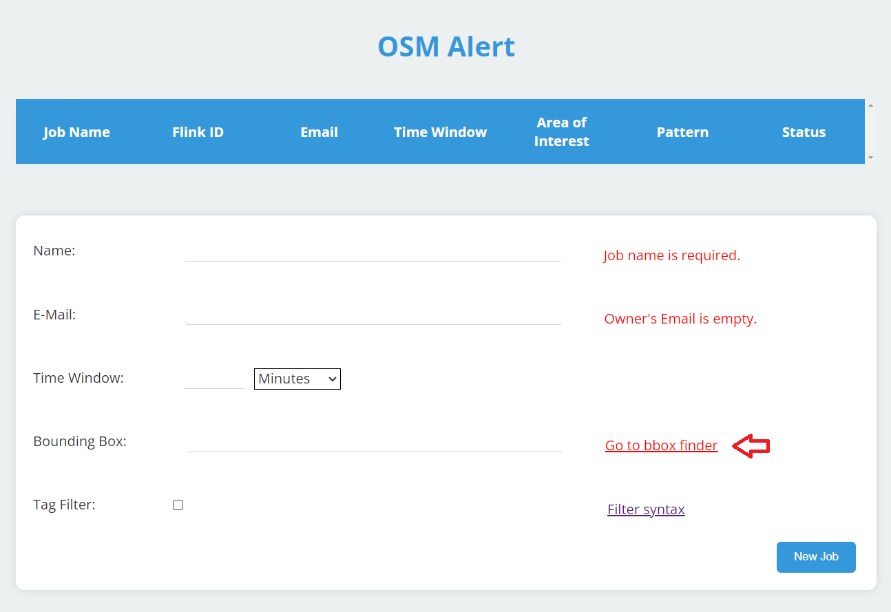
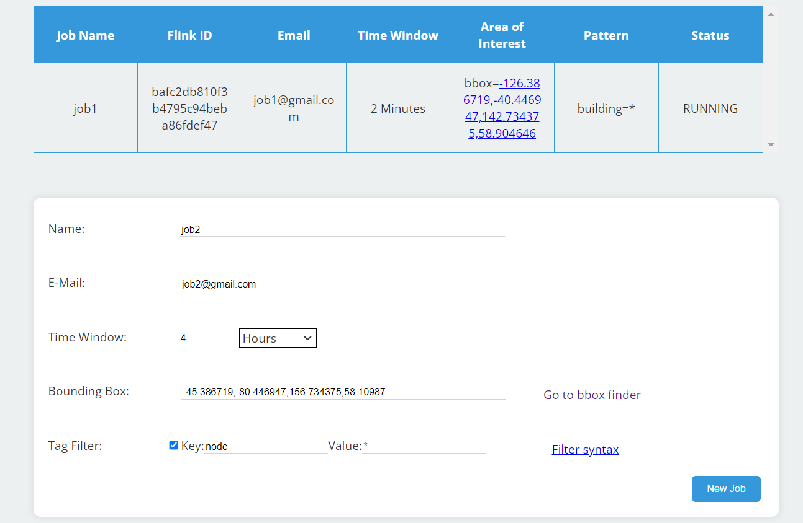

# OSMAlert - A web application for notifications about OSM changes

## Introduction

A large number of changes can happen due to destruction, flooding or blockades.
In these times of distresses, humanitarian organisations need to know when and
where changes happen, to help efficiently and in the right places.
Then timeliness update of map data is very important and OSMs
free availability supports the work of companies and NGOs.

OSMAlert uses OSM data to provide a notification system to inform humanitarian
organisations about changes in their appropriate areas in near real-time. They
get information whether a number of changes is higher than usual within an
e-mail.

The project was initiated by HeiGit with the main architecture and then
developed with students of the Heidelberg University.

## How it works

The application provides a website where jobs can be created to receive
notifications about OSM changes in a specific area.
The user has to give a unique job name, a valid e-mail address and coordinates
for a bounding box to submit the job.
The bounding box can be selected with the [bbox finder](http://bboxfinder.com).
A bounding box can be drawn and then the coordinates can be copied from there to
the OSMAlert website.

It is also possible to choose the time
interval in which the e-mails are sent. There are three options in the
time interval selection (minutes, hours, days).\
Another optional specification is the filtering for tags. There can be used any
key and value combination that is a valid tag in OSM.

After the submission of a job the application continuously calculates the
average of changes
in the given area based on historical data from the ohsome API and new incoming
changes.
Then the standard deviation is used to detect an unusual high amount of changes
and the user will be informed about it within the e-mail.\
The notification also contains the number of changes in the given time interval,
how many users changed something and a note if there were problems with
receiving the historical data for the calculation. An example of an e-mail can
be seen below.

## Technical foundations

OSM planet server\
data flow overview

## Conclusion

The application implements basic functionalities to get noticed when there are
changes in Open Street Map data within a given time interval.\
For further development the application can be extended to detect vandalism in
Open Street Map.