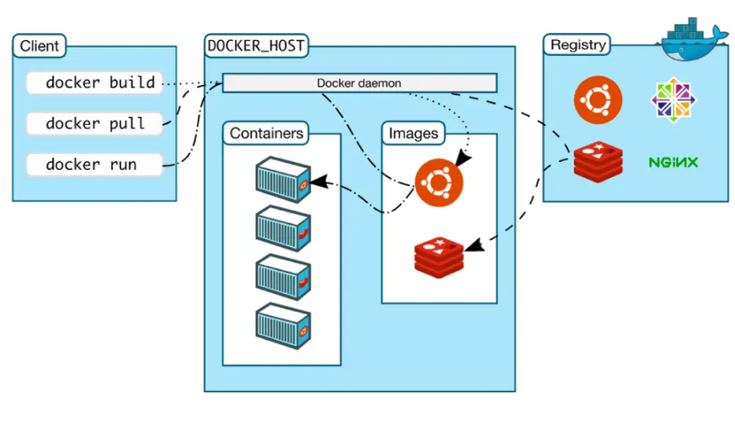

# Introduction to Docker

Docker is an open-source platform that enables developers to build, deploy, run, update and manage containers. Containers are lightweight, standalone, and executable packages that contain everything needed to run a piece of software, including the code, runtime, system tools, and libraries. Docker simplifies the process of packaging and distributing applications and their dependencies by encapsulating them within containers.

Containers have streamlined the process of developing and deploying distributed applications. They have gained significant traction as businesses transition to cloud-native development and hybrid multicloud setups. While developers can create containers without relying on Docker, using Docker significantly expedites, simplifies, and enhances the containerization process. As of the latest update, Docker boasts a user base of over 13 million developers who leverage its platform for containerization.

## Overview

**Why use Docker?**

Docker is so popular today that “Docker” and “containers” are used interchangeably. Docker lets developers access these native containerization capabilities using simple commands, and automate them through a work-saving application programming interface (API). Compared to LXC, Docker offers:

**Improved and seamless container portability:** While LXC containers often reference machine-specific configurations, Docker containers run without modification across any desktop, data center and cloud environment.

**Even lighter weight and more granular updates:** With LXC, multiple processes can be combined within a single container. This makes it possible to build an application that can continue running while one of its parts is taken down for an update or repair.

**Automated container creation:** Docker can automatically build a container based on application source code.

**Container versioning:** Docker can track versions of a container image, roll back to previous versions, and trace who built a version and how. It can even upload only the deltas between an existing version and a new one.

**Container reuse:** Existing containers can be used as base images—essentially like templates for building new containers.

**Shared container libraries:** Developers can access an open-source registry containing thousands of user-contributed containers.

Today Docker containerization also works with Microsoft Windows and Apple MacOS. Developers can run Docker containers on any operating system, and most leading cloud providers, including Amazon Web Services (AWS), Microsoft Azure, and IBM Cloud offer specific services to help developers build, deploy and run applications containerized with Docker.

**Why to use container and Why they are so popular?**

Container technology uses Linux kernel features like control groups (Cgroups) for resource allocation and namespaces for access control. This enables multiple application components to share the host OS, similar to VMs sharing hardware. Containers provide VM-like benefits such as isolation, scalability, and disposability, along with added advantages

**Lighter weight:** Unlike VMs, containers don’t carry the payload of an entire OS instance and hypervisor. They include only the OS processes and dependencies necessary to execute the code. Container sizes are measured in megabytes (vs. gigabytes for some VMs), make better use of hardware capacity, and have faster startup times.

**Improved developer productivity:** Containerized applications can be written once and run anywhere. And compared to VMs, containers are faster and easier to deploy, provision and restart. This makes them ideal for use in continuous integration and continuous delivery (CI/CD) pipelines and a better fit for development teams adopting Agile and DevOps practices.

**Greater resource efficiency:** With containers, developers can run several times as many copies of an application on the same hardware as they can using VMs. This can reduce cloud spending.

## Docker Architecture and tools

**Docker file**

A DockerFile is the foundational blueprint for every Docker container. It serves as an automated guide to create a Docker container image by providing a set of command-line instructions that the Docker Engine follows to construct the image. Despite the vast array of available Docker commands, they adhere to a standardized format, ensuring consistent behavior regardless of the specific contents, infrastructure, or environmental factors.

**Docker Image**

Docker images package an application's code and its dependencies. When executed, they become container instances. Developers often use existing images from repositories. Images are layered, each representing a version. Changes create new top layers, while previous layers are saved for future use or rollbacks. Containers add an extra layer for changes made during their runtime. This iterative process maximizes efficiency, allowing multiple containers to share a common base image and software stack.

**Docker containers**

Docker containers are the live, running instances of Docker images. While Docker images are read-only files, containers are life, ephemeral, executable content. Users can interact with them, and administrators can adjust their settings and conditions using Docker commands.

**Docker Hub**

Docker Hub is a vast repository of Docker images, offering over 100,000 images from various sources, including commercial vendors, open-source projects, and individual developers. It's a central hub for sharing and downloading Docker images, and users can freely contribute their own.

Users can also access pre-configured base images from Docker Hub to kickstart their containerization projects.

Additionally, there are other image repositories like GitHub. Docker Hub allows users to create repositories to store multiple images, and these repositories can be public or private. They can also be linked to accounts on platforms like GitHub or BitBucket for streamlined integration with development workflows.

**Docker Desktop**

Docker Desktop (link resides outside ibm.com) is an application for Mac or Windows that includes Docker Engine, Docker CLI client, Docker Compose, Kubernetes, and others. It also includes access to Docker Hub.

**Docker daemon**

Docker daemon is a service that creates and manages Docker images, using the commands from the client. Essentially Docker daemon serves as the control center of your Docker implementation. The server on which Docker daemon runs is called the Docker host.

**Docker registry**

A Docker registry is a scalable open-source storage and distribution system for Docker images. The registry enables you to track image versions in repositories, using tagging for identification. This is accomplished using git, a version control tool.

## Basic Commands 

**1. docker-version** - This command is used to get the current version of the docker

Syntax :- docker - -version [OPTIONS]

**2. docker pull** - Pull an image or a repository from a registry

Syntax :- docker pull [OPTIONS] NAME[: TAG|@DIGEST]

**3. docker run** - This command is used to create a container from an image

Syntax :- docker run [OPTIONS] IMAGE [COMMAND] [ARG...]

**4. docker ps** - This command is used to list all the containers

Syntax :- docker ps [OPTIONS]

**5. docker exec** - This command is used to run a command in a running container

Syntax :- docker exec [OPTIONS] CONTAINER COMMAND [ARG...]

**6. docker stop** - This command is used to stop one or more running containers

Syntax :- docker stop [OPTIONS] CONTAINER [CONTAINER...]

**7. docker restart** - This command is used to restart one or more containers

Syntax: docker restart [OPTIONS] CONTAINER [CONTAINER...]

**8. docker kill** - This command is used to kill one or more containers.

Syntax: docker kill [OPTIONS] CONTAINER [CONTAINER...]

**9. docker commit** - This command is used to create a new image from the container image.

Syntax: docker commit [OPTIONS] CONTAINER [REPOSITORY[:TAG]]

Docker commit command allows users to take an existing running container and save its current state as an image

There are certain steps to be followed before running the command

1. First , Pull the image from docker hub
2. Deploy the container using the image id from first step 
3. Modify the container (Any changes ,if needed)
4. Commit the changes

**10. docker push** - This command is used to push an image or repository to a registry

Syntax: docker push [OPTIONS] NAME[: TAG]

## Resources (Links)

https://www.ibm.com/topics/docker

https://docker-curriculum.com/

https://www.knowledgehut.com/blog/devops/basic-docker-commands

https://en.wikipedia.org/wiki/Docker_(software)#Components

https://www.xenonstack.com/blog/docker-container